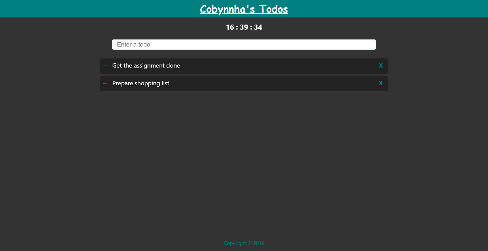
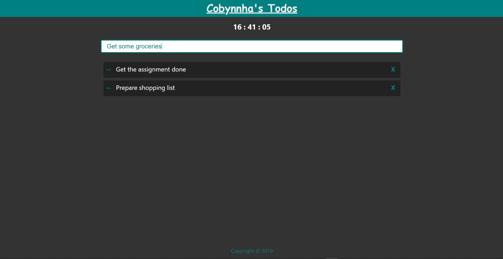

# React Firebase Todo App
A todo app built with ReactJS and Firebase. This was my first todo app.

## Screenshots

*Input field out of focus*

*Input field in focus*

## Link
[Visit app](https://tothepointcode.github.io/my-todo-app/)

## Tools Used
* [Reactjs](https://reactjs.org/)
* [Firebase](https://firebase.google.com/)